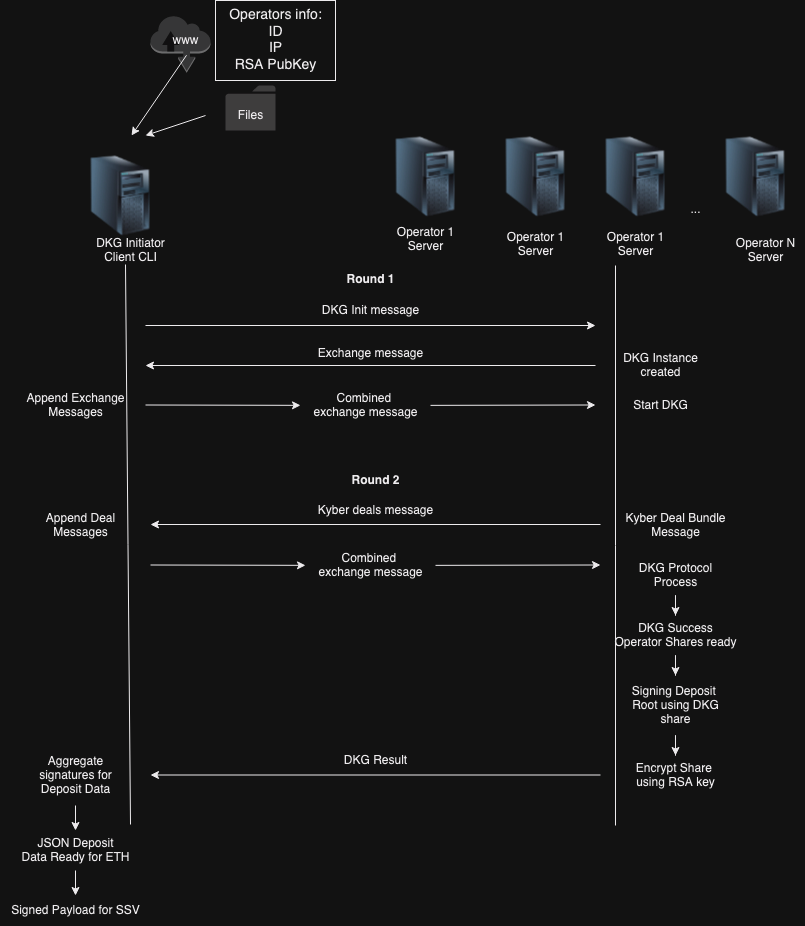

# ssv-dkg-tool

### Build

```sh
make install
```

### Operators data

The data of the operators (ID, IP, Pubkey) can be collected in any way, for example a central server that you can pull the data from, or a preset file where all operators data exist.

Information about operators can be collected at `json` file and supplied to initiator to use for a key generation.

Operators info file example (`./examples/operators_integration.json`):

```json
[
  {
    "id": 1,
    "public_key": "LS0tLS1CRUdJTiBSU0....",
    "ip": "http://localhost:3030"
  },
  {
    "id": 2,
    "public_key": "LS0tLS1CRUdJTiB....",
    "ip": "http://localhost:3031"
  }
]
```

### Operator

The dkg-operator is ran by a SSV operator, an Operator RSA private key is a requirement.
The operator is able to participate in multiple DKG ceremonies in parallel.

NOTE: dkgcli tool is using an ssv operator private key file. Encrypted and plintext versiaons are supported. If `password` parameter is provided then the dkgcli tool assumes that the operator`s RSA key is encrypted, if not then it assumes that the key is provided as plaintext.

#### Start a DKG-operator

```sh
dkgcli start-dkg-operator --privKey ./examples/operator1/encrypted_private_key.json  --port 3030 --password 12345678 --storeShare true

### where
--privKey ./encrypted_private_key.json # path to ssv operator`s private key
--port 3030 # port for listening messages
--password: 12345678 # password to decrypt the key
--storeShare # store created bls key share to a file for later reuse if needed
```

Its also possible to use yaml configuration file `./config/operator.yaml` for parameters. `dkgcli` will be looking for the config file at `./config/` folder.

Example:

```yaml
privKey: ./encrypted_private_key.json
password: 12345678
port: 3030
storeShare: true
```

When using configuration file, run:

```sh
dkgcli start-dkg-operator
```

### Initiator

The initiator uses `init-dkg` to create the initial details needed to run DKG between all operators.

```sh
dkgcli init-dkg \
          --operatorIDs 1,2,3,4 \
          --operatorsInfoPath ./examples/operators_integration.json \
          --owner 0x81592c3de184a3e2c0dcb5a261bc107bfa91f494 \
          --nonce 4 \
          --withdrawAddress 0000000000000000000000000000000000000009  \
          --fork 00000000
          --depositResultsPath deposit.json
          --ssvPayloadResultsPath payload.json
#### where
--operatorIDs 1,2,3,4 # operator IDs which will be used for a DKG ceremony
--operatorsInfoPath ./examples/operators_integration.json # path to operators info ID,base64(RSA pub key),
--owner 0x81592c3de184a3e2c0dcb5a261bc107bfa91f494 # owner address for the SSV contract
--nonce 4 # owner nonce for the SSV contract
--withdrawAddress # Reward payments of excess balance over 32 ETH will automatically and regularly be sent to a withdrawal address linked to each validator, once provided by the user. Users can also exit staking entirely, unlocking their full validator balance.
--fork "00000000" # fork id bytes in HEX
--depositResultsPath # path and filename to store the staking deposit file
--ssvPayloadResultsPath # path and filename to store ssv contract payload file
```

Its also possible to use yaml configuration file `./config/initiator.yaml` for parameters. `dkgcli` will be looking for this file at `./config/` folder.

Example:

```yaml
operatorIDs: [1, 2, 3, 4]
withdrawAddress: "0000000000000000000000000000000000000009"
owner: "0x81592c3de184a3e2c0dcb5a261bc107bfa91f494"
nonce: 4
fork: "00000000"
operatorsInfoPath: ./examples/operators_integration.json
depositResultsPath: ./deposit.json
ssvPayloadResultsPath: ./payload.json
```

When using configuration file, run:

```sh
dkgcli init-dkg
```

**_NOTE: Threshold is computed automatically using 3f+1 tolerance._**

### OPTIONAL: Generate RSA operator key

```sh
./dkgcli generate-operator-keys --password 12345678
```

---

### Architecture



#### Basic Flow Description:

1. The initiator creates an initial message, signs it and sends it to all operators (/init)
2. The operators upon receiving initial message check initiator message signature and create their DKG identity:

- new DKG secrets created
- if 5 mins pass after the last init message with ID [24]byte and new init message with the same ID is incoming the DKG instance is recreated
- `Exchange` signed message containing the DKG identity is created
- operator replies to init message with the created `Exchange` message

3. The initiator collects all responses into one message and verify signatures
4. The initiator sends back to all operators the combined message (/dkg)
5. Operators receive all exchange messages to start the DKG process, responding back to initiator with a signed dkg deal bundle
6. Initiator packs the deal bundles together and sends them back to all operators (/dkg)
7. Operators process dkg bundles and finish the DKG protocol of creating a shared key. After DKG process is finished each operator has a share of the shared key which can be used for signing
8. Operator using its share of the shared key signs a deposit root, encrypts with the initial RSA key the share and sends it to the initiator
9. Initiator receives all messages from operators with signatures/encrypted shares and prepares the deposit data with a signature and save it as JSON file
10. Initiator prepares a payload for SSV contract
11. After the deposit is successfull and SSV contract transaction is accepted, operators can continue with their duties using their share of the distributes key

The result of successfull DKG protocol at operator side:

```go
type Result struct {
	QUAL []Node // list of nodes that successfully ran the protocol
	Key  *DistKeyShare // the share of the node
}
type DistKeyShare struct {
    // Coefficients of the public polynomial holding the public key.
    Commits []kyber.Point
    // Share of the distributed secret which is private information. This will be used to sign. All sigs can be aggregated to create a T-threshold signature
    Share *share.PriShare
}
```

Output of an operator after DKG is finished:

```go
	// RequestID for the DKG instance (not used for signing)
	RequestID [24]byte
	// EncryptedShare standard SSV encrypted shares
	EncryptedShare []byte
	// SharePubKey is the share's BLS pubkey
	SharePubKey []byte
	// ValidatorPubKey the resulting public key corresponding to the shared private key
	ValidatorPubKey types.ValidatorPK
	// Partial Operator Signature of Deposit Data
	PartialSignature types.Signature
```

## DKG protocol description

#### Exchange message creation DKG protocol:

1. Upon receiving init message from initiator, operator creates (if not exists for init msg ID[24]byte) a kyber-bls12381 instance consisting of

- randomly generated scalar
- corresponding point in elliptic curve group G1 (384 bit)

2. Creates a signed with exchange message consisting of ID[24]byte and point bits

#### DKG protocol steps at operator after receiving all exchange messages from the initiator

1. Generation of DKG nodes:

- operator ID uint64;
- operators G1 point;

2. Creation of a time phaser
3. DKG time phaser starts DealPhase

- computes a private share for each of the operators ids
- encrypts with a corresponding to the operator BLS public key created at exchange step
- pack all deals together and signs

4. Deal bundle is created and sent back to the initiator

### DKG protocol steps at operator after receiving all deal messages from the initiator:

1. Creates the public polynomial from received bundle
2. For each deal decrypts a deal share
3. Checks if share is valid w.r.t. public commitment
4. Forms a response bundle

Initial message fields:

```go
 ID [16]byte //   random UUID
 // Operators involved in the DKG
 Operators []byte  // [ ID:pubkey ]  // uint8 ID 1byte + RSA pub key
 // T is the threshold for signing
 T uint64
 // WithdrawalCredentials for deposit data
 WithdrawalCredentials []byte
 // Fork ethereum fork for signing
 Fork [4]byte
  // Owner address
 Owner [20]byte
 // Nonce
 Nonce int
```

### `Switch` instance management

The DKG-operator can handle multiple DKG instances, it saves up to MaxInstances(1024) up to `MaxInstanceTime` (5 minutes). If a new Init arrives we try to clean our list from instances older than `MaxInstanceTime` if we find any, we remove them and add the incoming, otherwise we respond with error that the maximum number of instances is already running.

### TODO:

- [x] Complete design with flows and structure
- [x] output - signed ssv deposit data + encrypted shares for SSV contract
- [x] verification of ssv deposit data and encrypted shares
- [ ] existing validator public key resharing
- [x] CLI for initiator and operators
- [x] keystore for operators
- [x] more testing
- [x] logging

### Additional:

- [x] limit max of operators (T-threshold min/max)
- [x] secure the communication between initiator and operators

### Flow TODO Brakedown

---

- [~100%] New key generation

#### Round 1

- [x] CLI for initiator
- [x] CLI for operator
- [x] RSA secret storage for operator
- [x] Init message:
  - [x] Message sig validation
  - [x] Init message owner + nonce fields. ID is random UUID
  - [x] Timeouts
  - [x] Error handling
- [x] Exchange message:
  - [x] Message sig validation
  - [x] Timeouts
  - [x] Error handling
- [x] Code refactoring
- [x] Unit tests
- [x] integration tests

#### Round 2

- [x] Deal message:
- [x] Result message:
  - [x] Storage for key shares and DKG result
  - [x] Validate signature shares + validator pub key + pub and encrypted shares at initiator
- [x] Timeouts
- [x] Code refactoring
- [x] Error handling
- [x] Unit tests

---

- [50%] Key resharing (new operator keys but same validator pub key) - implemented 0%

- [x] CLI command and message to initiate resharing protocol
- [x] Handlers of DKG key resharing messages exchange
- [ ] Store new keys, update storage at operators
- [ ] Error handling
- [ ] Unit tests
